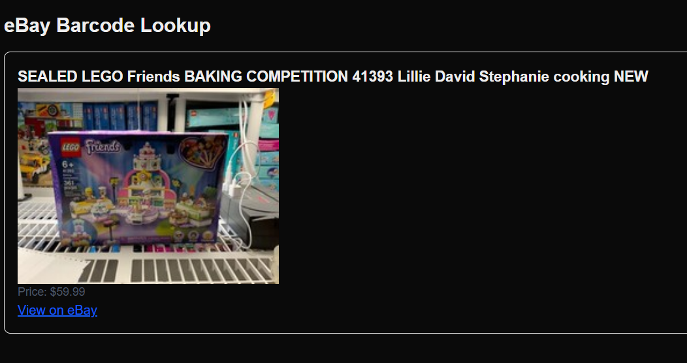

# 📦 eBay Barcode Lookup

A mobile-first Next.js app that scans product barcodes and instantly retrieves live listing data from eBay's Browse API — including title, image, price, and a direct link to the product.

Built as a portfolio piece to showcase real-world API integration, OAuth token handling, and camera-based barcode scanning.

---

## ✨ Features

- 🔍 **Real-time barcode scanning** using your device's camera (via `@zxing/library`)
- 📦 **UPC search fallback** via manual input
- 📬 **Live eBay product lookup** using GTIN (UPC-A)
- 🔐 **OAuth2 client_credentials** flow for secure token generation
- ⚡ **Fast, responsive UI** tailored for mobile-first usage
- 🛠️ Built with **Next.js App Router**, **TailwindCSS**, and **TypeScript**

---

## 🚀 Demo



> Example UPC scanned: `673419319782` (LEGO Friends Baking Competition)

---

## 🧪 Tech Stack

- **Next.js** with App Router
- **TypeScript**
- **TailwindCSS**
- **@zxing/library** for camera + barcode scanning
- **eBay Browse API** for product data
- **OAuth2 Client Credentials Flow** for secure token access

---

## 📂 Project Structure

```bash
components/
  └── BarcodeScanner.tsx       # Video feed and ZXing scanner
  └── ProductCard.tsx          # Renders eBay product result

app/
  └── page.tsx                 # Main client-side UI
  └── api/lookup/route.ts      # Serverless API route for UPC lookup

lib/
  └── ebay.ts                  # Handles OAuth2 token generation
